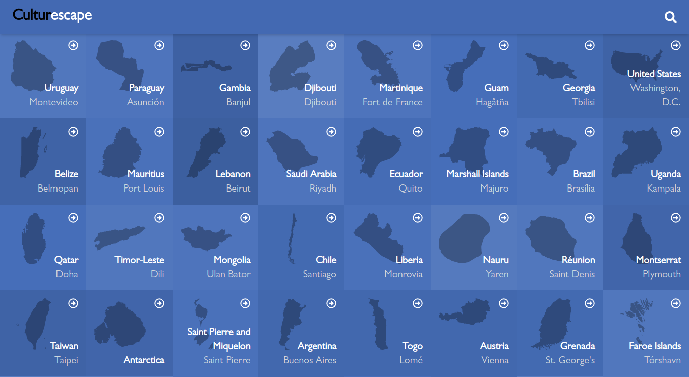
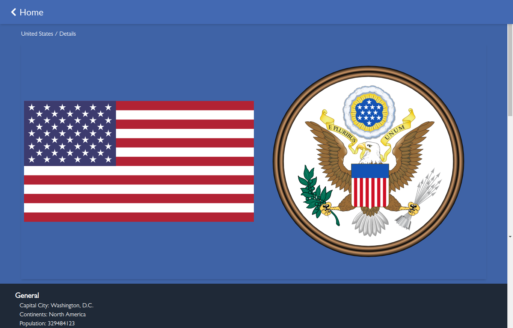

# Culturescape - Metrics webapp


> Here you can let go of your imagination and discover amazing facts about countries around the world.
> From legal facts to cultural facts, here you will find what you need to impress your friends and family.

## Screenshots

- **Home page**



- **Country details page**



## Video walkthrough

[More about the metrics-webapp](https://www.loom.com/share/5fdbbcbe22924dddb3c8d910deecbd18)

## Built With

- HTML5, CSS3
- JavaScript ES6, React/Redux, Tailwind, Sass
- CLI, TDD, gh-pages, Gitflow, Integration tests

## Live demo

[Culturescape](https://jssol.github.io//metrics-webapp/)

## Getting Started

To get a local copy up and running follow these simple example steps:
- Open Terminal.
- Change the current working directory to the location you want the cloned directory.
- Enter the following:
```
$ git clone git@github.com:jssol/metrics-webapp.git.
```
- Press Enter to create your local clone.
- Navigate to the cloned repository by running:
    ```
    $ cd metrics-webapp
    ```
- Install all dependencies using:
    ``` 
    $ npm install
    ```

- Run local server using:
    ```
    $ npm run build
    $ npm start
    ```
- Run unit tests using:
    ```
    $ npm run test

    ```

### Prerequisites
- GitHub
- Git
- Node.js

## Authors

👤 **Jonathan Sivahera**

- GitHub: [@jssol](https://github.com/jssol)
- Twitter: [@jsivahera](https://twitter.com/jsivahera)
- LinkedIn: [jsivahera](https://www.linkedin.com/in/jsivahera/)

## Contributors

Contributions, issues, and feature requests are welcome!

Feel free to check the [issues page](https://github.com/jssol/metrics-webapp/issues).

## Acknowledgement

Original design idea by [Nelson Sakwa on Behance](https://www.behance.net/sakwadesignstudio).

## Show your support

Give a ⭐️ if you like my portfolio!

## 📝 License

- This project is [AGPL-3.0](./LICENSE) licensed.
